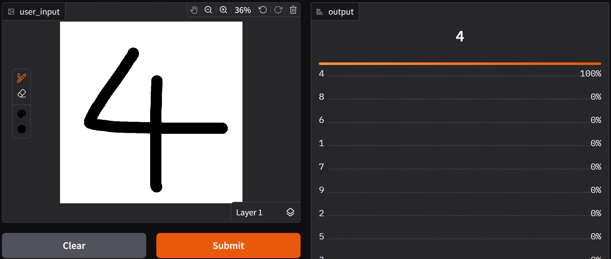
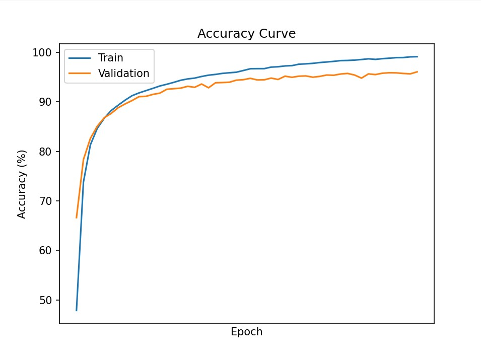
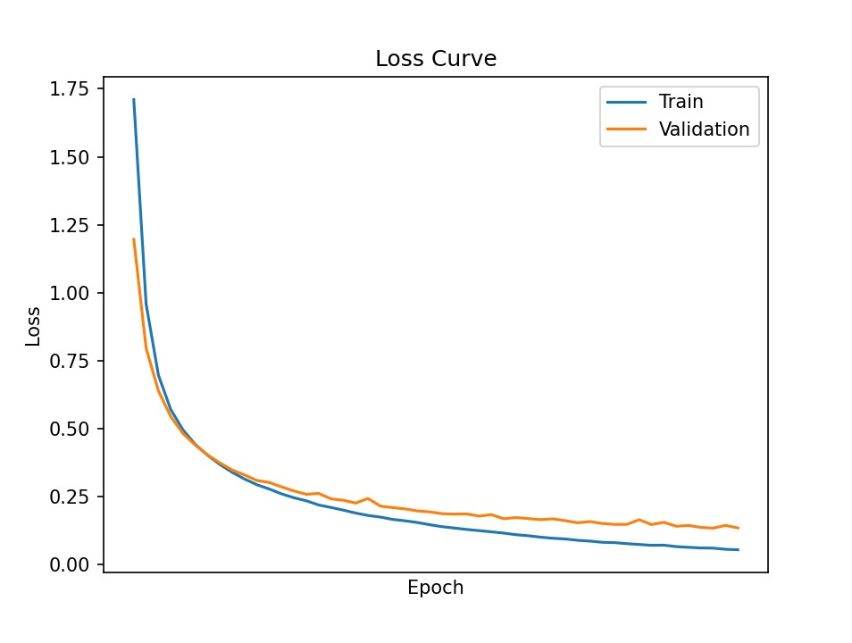
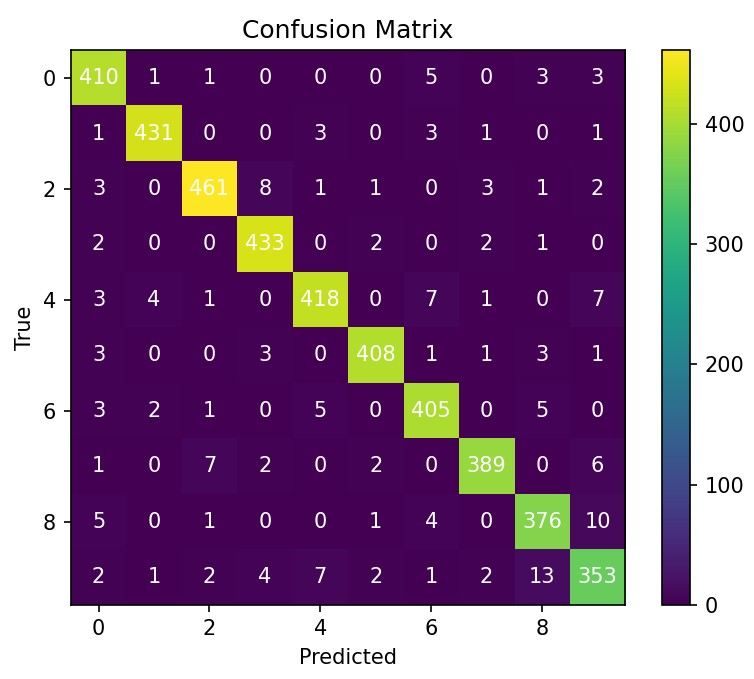
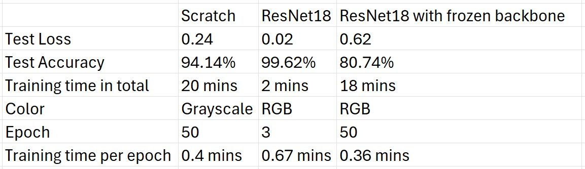

# Model Comparison In Handwritten Digit Classification  
A comparative study of CNN and ResNet18 for handwritten digit classification with detailed evaluation and analysis.

## Overview
- Task: Comparing a CNN model built from scratch and a ResNet18 model in handwritten digit classification (from 0 to 9)
- Model: Convolutional Neural Network (CNN)
- Goal: Building a CNN model from scratch, comparing the model with ResNet18 on a custom dataset and implementing an interactive demonstration  

## Why choosing CNN
CNN models are a strong baseline in image classification because of their ability to learn local spacial features effectively, and perform sufficiently even with a small dataset.  

In contrast, Vision Transformer (ViT) models, while outperform CNN models thanks to global dependencies, require significantly more data and computational resources to train effectively.  

Given the limited size of the dataset in this project, CNN is considered a more suitable and practical choice.  

## Demonstration
- A demonstration of the CNN model from scratch is produced at HuggingFace Space: https://huggingface.co/spaces/Fuyuki0312/CNN-model-built-from-scratch
- Or for the ResNet18 model: https://huggingface.co/spaces/Fuyuki0312/ResNet18-in-handwritten-digit-classification
- The Space may need a few seconds to initialize if inactive. 
- Note: Input image's background color should be white by default.  
  

## Metrics

### CNN model built from scratch
- The model reached approximately 94% test accuracy.  

 
  
(Confusion matrix collected model's prediction during validation after finishing training)
- The model sometimes confuses digits like 0, 3, 6, 8, and 9 due to similar rounded shapes and different handwritting styles.  

### ResNet18
- The model reached approximately 99% test accuracy.  
 

(The graphs collected metrics each epoch and since the ResNet18 model was trained on only 3 epochs, the "curves" appear to be quite linear)  
- While ResNet18 performed effectively on the dataset with reliable metrics, it may not necessarily be consistent to correctly predict real-world handwritten digits. Therefore, these metrics should be interpreted with caution.

### Comparison

- Thanks to being pretrained on large-scale datasets, the ResNet18 model required much fewer epochs (only 3) to train, despite taking insignificantly more time to train each epoch, which was 0.67 min/epoch. This model resulted in a considerably high test accuracy, being approximately higher than 99%, without the need of transforming data into grayscale.
- The CNN model built from scratch, on the other hand, reached an acceptable test accuracy, yet demanded many times more epochs (50 epochs), leading to longer training time. After data had been transformed into grayscale, this model was trained with a speed of roughly 0.4 min/epoch, achieving about 94% test accuracy.
- A ResNet18 model with frozen backbone is not recommended because ~81% test accuracy cannot be considered satisfactory in handwritten digit classification. The model's backbone being frozen limited the model's ability to adapt the dataset, reducing the model's capability of understanding data's patterns.
- Overall, the ResNet18 model outperforms the custom CNN model with noticeably less total time to train in this project, although ResNet18 model requires slightly more computational resoures.  

Note: The ResNet18 model with a frozen backbone as well as the relating graphs showing its metrics are not included in this repository, as it exhibited unstable training behavior and poor generalization.  

## Dataset  

This project uses a custom dataset of handwritten digits (0–9).  
The original dataset: https://www.kaggle.com/datasets/olafkrastovski/handwritten-digits-0-9  
Total images: approximately 20000 images with each label has about 2000 images  

### Data Cleaning  

The dataset was manually inspected and cleaned to improve quality:  

- Removed corrupted images or ones that can be hardly seen
- Filtered out images where digits are not clearly visible

### Data Characteristics
- Image size: 90×140
- Includes variations in handwriting styles and stroke thickness
- There is a number of digits which are not centered and have various size
- Some digits are visually similar (e.g., 0, 6, 8, 9), which introduces ambiguity

### Data Augmentation  
Heavy transformations (e.g., random rotation, large scaling) were avoided to preserve digit structure. However, some transformations are available in `train.py` in commentary form, meaning that they can be enabled by deleting sharp symbols "#". For more detailed, you can take a further look at `train.py`.

## How to use the models
Note: before following the instruction below, you may want to go to folder `CNN model from scratch` or `ResNet18` first.
- To continue to train the existing models, consider to run `train.py` with both `ModelDetectingNumber.pth` and `model.py` in the same directory. Hyperparameters in files can be changed to suit your need. Besides, if you wish to train a completely new model, simply delete or move file `ModelDetectingNumber.pth` away. When `ModelDetectingNumber.pth` is not found, `train.py` will automatically initialize a new model based on `model.py`.
- The dataset, used for training, should be put in the same directory with `train.py` under a folder named `numbers`, with the following structure:  
`numbers`/  
├── 0/  
│   ├── `img1.png`  
│   ├── `img2.png`  
│   └── ...  
├── 1/  
│   ├── `img1.png`  
│   └── ...  
├── 2/  
├── 3/  
├── 4/  
├── 5/  
├── 6/  
├── 7/  
├── 8/  
└── 9/  
- If you want to use the models only for inference, you can import the models from `model.py` with weights loaded from `ModelDetectingNumber.pth`.
- Beisdes, `PlotConfusionMatrix.py` can be used to plot confusion matrix for the current model with weights loaded from `ModelDetectingNumber.pth`.  

## Limitation
- The models usually give right predictions only when the background color of input images is white because the models were trained primarily on numerical images with white backgrounds.
- When the input image is ambiguous or low-quality, the models may confidently produce a wrong prediction.

## Possible Improvements
- Expanding the dataset to include numerical images with diverse backgrounds (dark, textured, etc) might be a solution to enable models to predict images with black background and white digits.
- Since some digits have more than one handwritting style, adding more numerical images written in a wider range of styles to the dataset can help models become more familiar with human-like digits.
